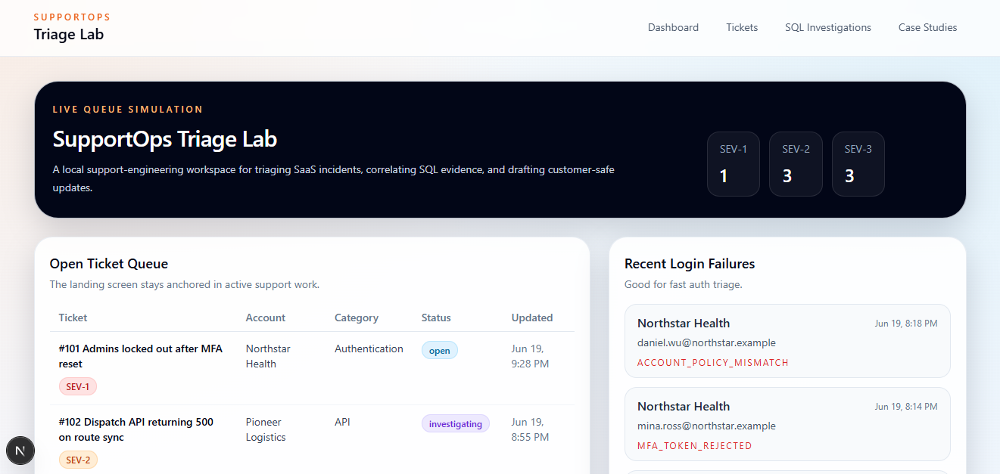
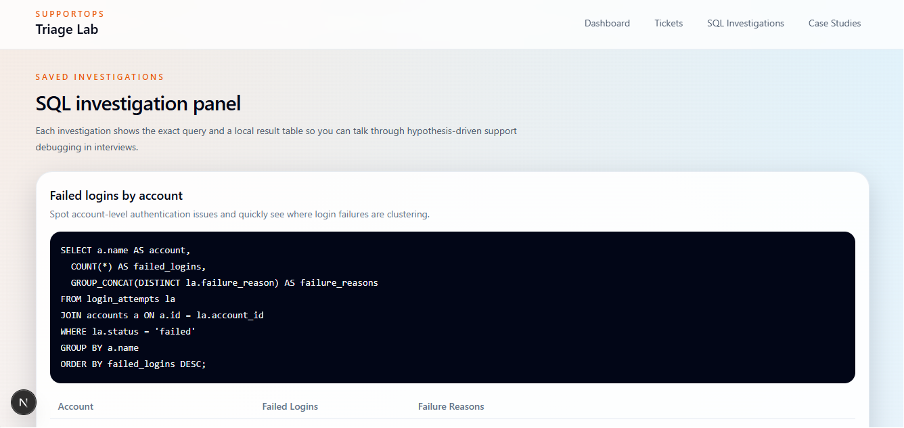
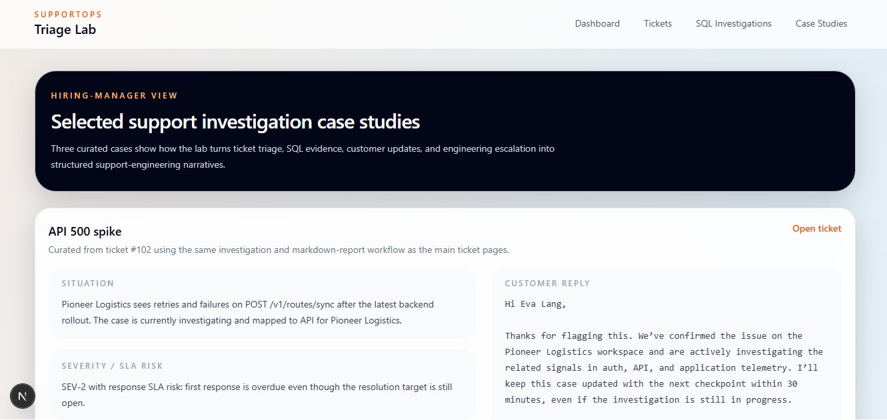
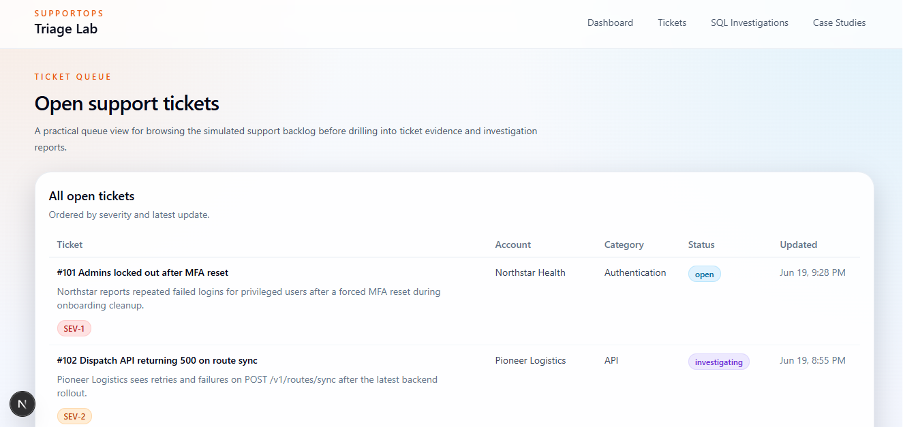

# SupportOps Triage Lab

A local support-engineering portfolio app demonstrating SaaS ticket triage, SQL investigation, SLA prioritization, customer communication, and engineering escalation.

SupportOps Triage Lab is a local portfolio project that simulates a B2B SaaS technical support queue. The app is designed to show support-engineering judgment rather than marketing polish: triage dashboards, SQL-driven investigation, telemetry correlation, escalation notes, and customer-facing communication drafts.

This is a local portfolio lab for demonstration and interview walkthroughs, not a production SaaS product.

## Screenshots



Support queue, severity counts, and recent login failures.



Saved queries and result tables for support debugging.



Selected support investigation writeups for technical support and application support interviews.



Browsable support backlog for drilling into evidence.

## What The App Demonstrates

- A seeded SQLite dataset for support workflows across `accounts`, `users`, `tickets`, `login_attempts`, `app_events`, `api_requests`, and `subscriptions`
- A dashboard-first support queue with SLA risk, login failures, API spikes, impacted accounts, and open-ticket severity distribution
- Ticket detail views that combine metadata, account context, user context, related telemetry, and suggested support actions
- A SQL investigation panel with saved investigation queries and result tables for interview walkthroughs
- Practical support-writing artifacts, including customer replies, escalation notes, troubleshooting checklists, and root-cause summaries

## Stack

- Next.js
- TypeScript
- Tailwind CSS
- SQLite via Node's built-in `node:sqlite`

## How To Run It

1. Install dependencies:

```bash
npm install
```

2. Start the local app:

```bash
npm run dev
```

3. Open `http://localhost:3000`

The SQLite database is created automatically inside `.data/supportops.db` and reseeded on startup when the seed version changes.

## Support-Engineering Skills Shown

- Prioritizing tickets by severity and SLA risk
- Correlating customer reports with auth, API, and product telemetry
- Using SQL to validate hypotheses instead of guessing
- Recognizing duplicate incidents and account-wide impact
- Writing customer-safe status updates during active investigation
- Handing off crisp engineering escalation notes with business context
- Summarizing probable root cause and next actions clearly

## Saved Investigations Included

1. Failed logins by account
2. API 500 spike by endpoint
3. Users affected by browser-specific blank dashboard
4. SLA breach candidates
5. Duplicate reports from same account
6. Subscription/payment mismatch
7. Permission denied errors after role change
8. Webhook delivery delays

## Support Investigation Reports

Each ticket detail page includes a generated support investigation report that turns case data into a concise exportable note. For Technical Support Engineer and Application Support roles, this helps show not just what support reviewed, but what still needs engineering verification, what the customer should hear next, and what support already ruled out.

## Supporting Docs

- [Sample support investigation report](docs/sample-report.md)
- [Support runbook](docs/support-runbook.md)
- [Interview talking points](docs/interview-talking-points.md)

## Example Interview Talking Points

- How the dashboard mirrors a real support queue instead of a generic analytics page
- Why ticket detail pages combine customer context with evidence from multiple systems
- How saved investigations help explain support debugging workflows in a structured way
- How severity suggestions and next-step guidance reflect support-engineering prioritization
- Where the seeded incidents model common SaaS support patterns: auth regressions, 403s after role changes, webhook lag, frontend rollout bugs, and billing inconsistencies

## Notes

- This is intentionally local-only and does not include auth.
- The dataset is fake but structured to feel plausible during demos and interviews.

## GitHub Topics

`technical-support`, `application-support`, `support-engineering`, `sql`, `nextjs`, `typescript`, `sqlite`, `portfolio`

## LinkedIn / Resume Blurb

Built a local support-engineering portfolio app that simulates SaaS ticket triage, SQL investigation, SLA prioritization, customer replies, and engineering escalation notes using Next.js, TypeScript, Tailwind, and SQLite. The project includes a realistic support queue, saved SQL investigations, ticket-level evidence views, generated investigation reports, and selected case studies.

## License

MIT. See [LICENSE](LICENSE).

## Author

Jeremy Ray Jewell  
[GitHub](https://github.com/jeremyrayjewell) | [LinkedIn](https://www.linkedin.com/in/jeremyrayjewell)
